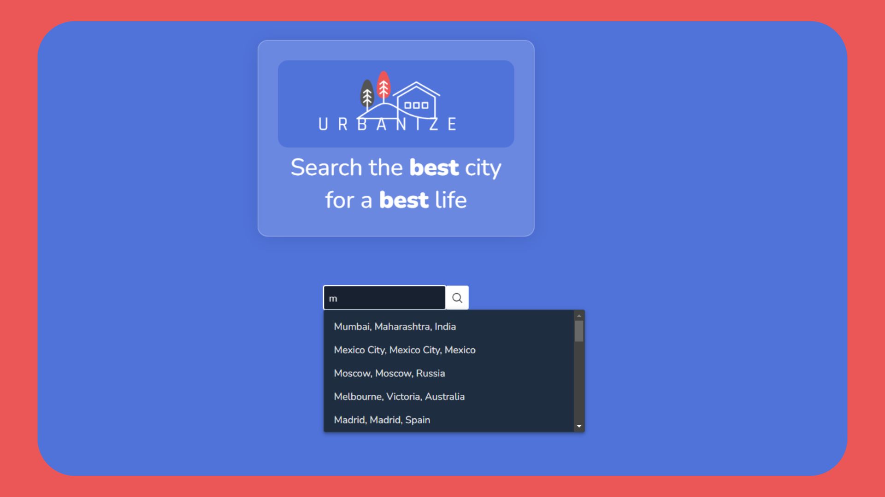

# Urbanize

`Urbanize` utilizes the `Teleport API` to showcase data on the quality of life in major cities around the world, including housing, cost of living, startups, safety, healthcare, education, taxation, and more. The platform provides users with an intuitive and engaging way to compare and contrast this data, helping them to identify trends and patterns in order to make better-informed decisions about where to live, work, or travel. 
By leveraging data and technology in this way, the project empowers users to better understand the world around them, and to make choices that positively impact their quality of life.

## Usage

Users can search for a city in the search bar, and the application will suggest cities based on the input. However, it is important to note that quality of life data is only available for major cities around the world. Once a city is selected from the suggested list, if it exists in the database, the application will display a card with basic information about the city and its overall score, as well as a sortable table with all the data and a chart. This allows users to easily compare and analyze the data for each category in a visual and interactive way.

## Tecnologies

This project was generated with [Angular CLI](https://github.com/angular/angular-cli) version 15.1.3 and [PrimeNg](https://primeng.org/) components library and its chart component, which is built on the Chart.js library.

## Install

Run `npm install` on your device for try the application.
## Development server

Run `ng serve` for a dev server. Navigate to `http://localhost:4200/`. The application will automatically reload if you change any of the source files.

## Build

Run `ng build` to build the project. The build artifacts will be stored in the `dist/` directory.

